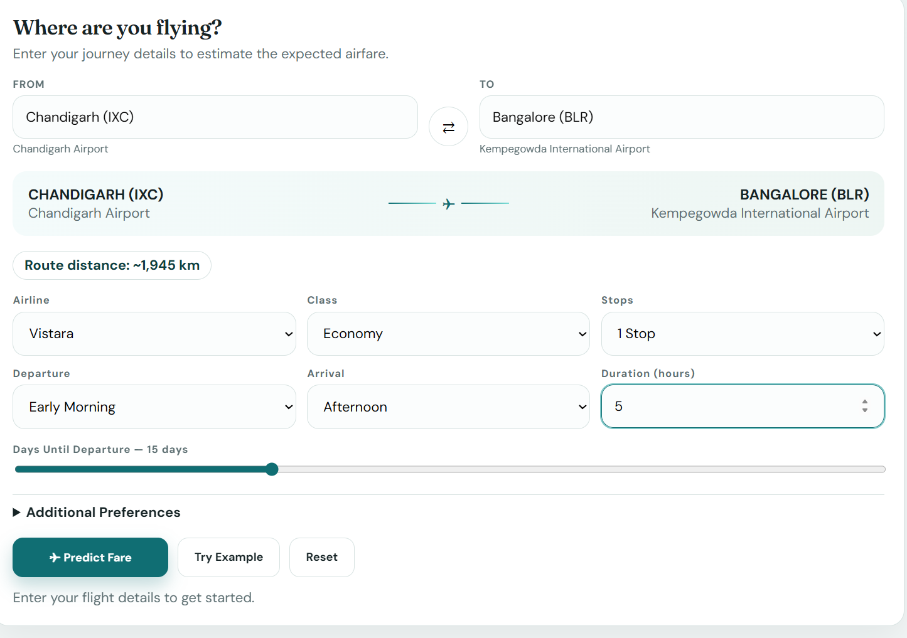
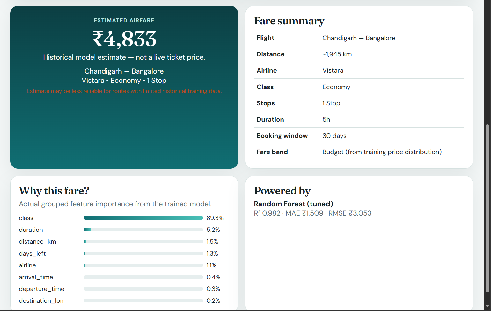
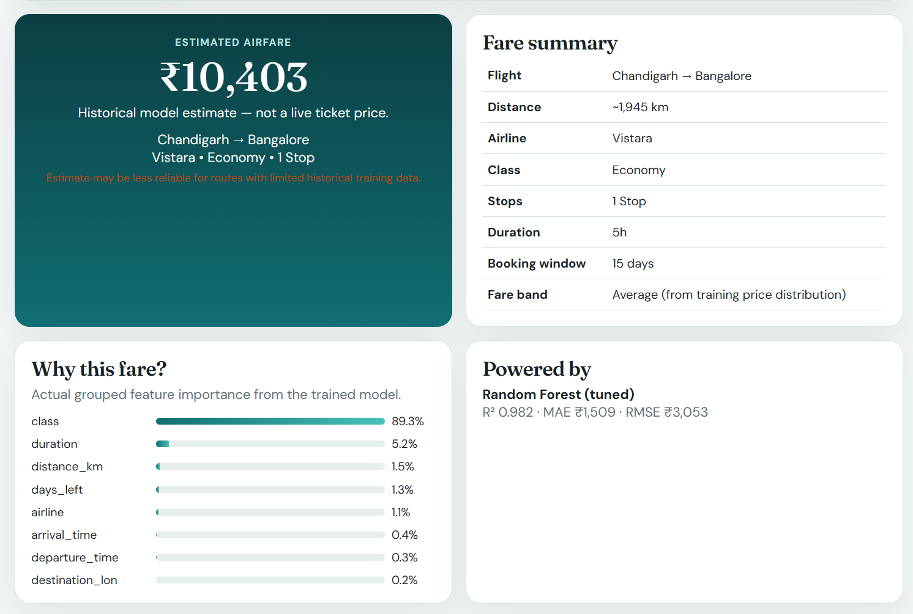

# ✈️ SkyCast AI — Airfare Price Prediction

> An end-to-end machine learning system that estimates airfare prices from historical flight data.

SkyCast AI is a machine learning-powered airfare prediction platform designed to estimate the expected price of a flight based on factors such as airline, travel class, number of stops, journey duration, booking window, route distance, and geographic information.

The project combines a trained machine learning model with a FastAPI backend and a React/Vite frontend to provide an interactive airfare estimation experience.

---

## 📸 Screenshots

### Flight Prediction Interface



The prediction interface allows users to enter their journey details, including:

- Departure airport
- Destination airport
- Airline
- Travel class
- Number of stops
- Departure time
- Arrival time
- Flight duration
- Days until departure

The application also calculates the approximate route distance automatically.

---

### Estimated Fare



After submitting the flight details, SkyCast AI provides an estimated airfare along with a summary of the selected flight.

> **Important:** The displayed price is a historical machine-learning estimate and is not a live airline ticket price.

---

### Model Explanation



The application also provides information about the model and the features that contribute most strongly to the prediction.

The current model reports grouped feature importance, helping users understand which factors influence the trained model most.

---

# 🎯 Project Objective

The goal of SkyCast AI is to build an end-to-end airfare prediction system that can:

1. Clean and validate historical flight data
2. Engineer useful flight and geographic features
3. Compare multiple regression algorithms
4. Train and tune a machine learning model
5. Save the complete preprocessing and prediction pipeline
6. Serve predictions through a REST API
7. Provide an interactive web interface
8. Explain model performance and feature importance

---

# 🧠 Machine Learning

SkyCast AI treats airfare prediction as a **supervised regression problem**.

### Target

```text
price
```

The target variable represents the historical airfare in Indian Rupees (INR).

### Input Features

The model uses a combination of categorical, numerical, and geographic features.

#### ✈️ Flight Features

- Airline
- Travel class
- Number of stops
- Departure time
- Arrival time
- Flight duration

#### 📅 Booking Features

- Days until departure

#### 🌍 Geographic Features

- Source latitude
- Source longitude
- Destination latitude
- Destination longitude
- Route distance in kilometers

These features are processed before being passed to the trained machine learning model.

---

# ⚙️ Feature Engineering

Feature engineering is an important part of the SkyCast AI pipeline.

The system transforms raw flight information into features that can be used by the machine learning model.

### Geographic Features

Airport coordinates are used to determine:

```text
Source Latitude
Source Longitude
Destination Latitude
Destination Longitude
```

The application then calculates the approximate distance between the source and destination airports.

### Route Distance

Distance is calculated using the **Haversine formula**, which estimates the great-circle distance between two geographic coordinates.

For example:

```text
Chandigarh (IXC)
        ↓
    ~1,945 km
        ↓
Bangalore (BLR)
```

This distance becomes an additional numerical feature for the prediction model.

---

# 🤖 Machine Learning Models

Multiple regression models were evaluated during the development of SkyCast AI.

The project explores models including:

- Linear Regression
- Ridge Regression
- Random Forest
- Gradient Boosting
- HistGradientBoosting
- XGBoost

After model comparison and tuning, **Random Forest** was selected as the production model.

---

# 🌲 Production Model

The deployed prediction system uses a tuned:

## Random Forest Regressor

The model configuration includes:

```text
n_estimators = 100
max_depth = 16
min_samples_leaf = 2
```

The model is integrated with the preprocessing pipeline so that incoming user data goes through the same transformations used during training.

The saved pipeline is then loaded by the FastAPI backend to generate predictions.

---

# 📊 Model Performance

The production model achieved the following results on the historical random-row holdout evaluation:

| Metric | Score |
|---|---:|
| R² | 0.9819 |
| MAE | ₹1,508.89 |
| RMSE | ₹3,052.77 |

### R² — 0.9819

R² measures how much of the variation in the target variable is explained by the model.

A score of approximately **0.982** indicates strong performance on this evaluation split.

### MAE — ₹1,508.89

Mean Absolute Error represents the average absolute difference between the predicted fare and the actual historical fare.

The model's average error on this evaluation was approximately:

```text
₹1,509
```

### RMSE — ₹3,052.77

Root Mean Squared Error gives greater weight to larger prediction errors.

The RMSE was approximately:

```text
₹3,053
```

---

# 🔬 Route-Group Validation

In addition to random-row evaluation, the project also evaluates the model using a stricter **route-group validation** approach.

This tests how the model performs when complete routes are held out from the training data.

| Metric | Route-Group Validation |
|---|---:|
| R² | 0.9165 |
| MAE | ₹3,470.47 |
| RMSE | ₹6,321.44 |

This evaluation provides a more conservative indication of model performance when predicting routes that are less represented or unseen during training.

> Model performance can vary significantly depending on the route, airline, booking window, and available historical data.

---

# 🔍 Feature Importance

The application displays grouped feature importance from the trained Random Forest model.

Current feature importance:

| Feature | Importance |
|---|---:|
| Class | 89.3% |
| Duration | 5.2% |
| Distance | 1.5% |
| Days Left | 1.3% |
| Airline | 1.1% |
| Arrival Time | 0.4% |
| Departure Time | 0.3% |
| Destination Longitude | 0.2% |

### Why this matters

Feature importance provides an indication of which features the trained model relies on most when making predictions.

In the current model, **travel class** has the largest contribution, followed by flight duration and route-related features.

> Feature importance indicates model behavior and should not be interpreted as a causal explanation of airfare pricing.

---

# 🏗️ System Architecture

SkyCast AI follows an end-to-end architecture:

```text
┌──────────────────────────┐
│      React Frontend      │
│        Vite UI           │
└────────────┬─────────────┘
             │
             │ HTTP / REST API
             ▼
┌──────────────────────────┐
│      FastAPI Backend     │
│                          │
│ • Input Validation       │
│ • Airport Lookup         │
│ • Distance Calculation   │
│ • Prediction Service     │
└────────────┬─────────────┘
             │
             ▼
┌──────────────────────────┐
│   ML Preprocessing       │
│   & Prediction Pipeline  │
│                          │
│ • Feature Engineering    │
│ • Encoding               │
│ • Random Forest          │
└────────────┬─────────────┘
             │
             ▼
┌──────────────────────────┐
│    Estimated Airfare     │
│          ₹ INR           │
└──────────────────────────┘
```

---

# 🧩 Technology Stack

## Backend

- Python
- FastAPI
- Uvicorn
- Pydantic
- Pandas
- Scikit-learn
- Joblib
- PyYAML

## Machine Learning

- Python
- Pandas
- NumPy
- Scikit-learn
- XGBoost
- Random Forest
- Gradient Boosting
- Feature Engineering
- Model Evaluation

## Frontend

- React
- Vite
- JavaScript
- JSX
- React Router
- Recharts
- CSS

## Data & Geographic Processing

- Historical flight data
- Airport reference data
- Geographic coordinates
- Haversine distance calculation

---

# 📁 Project Structure

```text
Skycast-ai/
│
├── backend/
│   ├── app/
│   │   ├── config.py
│   │   ├── main.py
│   │   ├── schemas.py
│   │   └── services/
│   │       ├── model_service.py
│   │       └── prediction_service.py
│   │
│   ├── model_loader.py
│   ├── schemas.py
│   └── requirements.txt
│
├── frontend/
│   ├── src/
│   ├── index.html
│   ├── package.json
│   └── vite.config.js
│
├── data/
│   ├── raw/
│   ├── processed/
│   ├── reference/
│   └── README.md
│
├── docs/
│   ├── api.md
│   ├── architecture.md
│   ├── data_dictionary.md
│   ├── model_card.md
│   └── project_report.md
│
├── notebooks/
│
├── models/
│   ├── metrics.json
│   ├── feature_importance.json
│   ├── model_metadata.json
│   ├── model_comparison.json
│   ├── geo_experiment.json
│   └── validation.json
│
├── tests/
│
├── Documents_&_Images/
│   ├── home.png
│   ├── prediction.png
│   └── fare-analysis.png
│
├── config.yaml
├── requirements.txt
├── .gitignore
├── LICENSE
└── README.md
```

---

# 🚀 Getting Started

## Prerequisites

Make sure you have installed:

- Python 3.10+
- Node.js 18+
- npm
- Git

---

# 🐍 Backend Setup

Clone the repository:

```bash
git clone https://github.com/LearnWithCherry/Skycast-ai.git
cd Skycast-ai
```

Create a Python virtual environment:

```bash
python -m venv .venv
```

### Windows

```bash
.venv\Scripts\activate
```

### macOS / Linux

```bash
source .venv/bin/activate
```

Install backend dependencies:

```bash
pip install -r backend/requirements.txt
```

Start the FastAPI server:

```bash
uvicorn backend.app.main:app --reload --port 8000
```

The backend should now be available at:

```text
http://localhost:8000
```

FastAPI interactive API documentation:

```text
http://localhost:8000/docs
```

---

# ⚛️ Frontend Setup

Open another terminal.

Navigate to the frontend:

```bash
cd frontend
```

Install dependencies:

```bash
npm install
```

Start the development server:

```bash
npm run dev
```

The frontend will normally be available at:

```text
http://localhost:5173
```

Open the displayed URL in your browser.

---

# 🔮 How the Prediction Works

A user enters their flight information through the web interface.

For example:

```text
From: Chandigarh (IXC)
To: Bangalore (BLR)

Airline: Vistara
Class: Economy
Stops: 1 Stop

Departure: Early Morning
Arrival: Afternoon

Duration: 5 hours
Days Until Departure: 15 days
```

The application processes the request through the following pipeline:

```text
User Input
    ↓
Input Validation
    ↓
Airport / Location Resolution
    ↓
Geographic Feature Generation
    ↓
Route Distance Calculation
    ↓
Feature Preprocessing
    ↓
Random Forest Model
    ↓
Airfare Prediction
    ↓
Result Display
```

Example output:

```text
Estimated Airfare
₹10,403
```

The application also displays a summary of the flight and information about the model.

---

# 🧭 User Interface

The SkyCast AI interface provides a simple workflow for airfare estimation.

### Step 1 — Select the route

Choose:

```text
Departure Airport
Destination Airport
```

The interface displays the approximate route distance.

### Step 2 — Enter flight details

Select:

```text
Airline
Travel Class
Number of Stops
Departure Time
Arrival Time
Flight Duration
```

### Step 3 — Select booking window

Choose the number of days until departure.

### Step 4 — Predict

Click:

```text
✈ Predict Fare
```

The system sends the information to the FastAPI backend.

### Step 5 — View the result

The application displays:

- Estimated airfare
- Flight summary
- Route distance
- Airline
- Class
- Stops
- Duration
- Booking window
- Fare band
- Model information
- Feature importance

---

# 🌍 Geographic Processing

SkyCast AI uses airport geographic information to improve route-level prediction.

For each route, the system can use:

```text
Source Airport
Destination Airport
Source Latitude
Source Longitude
Destination Latitude
Destination Longitude
```

The distance between the airports is then calculated.

This provides the model with an additional numerical representation of the route.

---

# 🧪 Testing

The project includes tests for important application components.

Tests cover areas such as:

- Data processing
- Feature engineering
- Geographic calculations
- Model loading
- Prediction logic
- API validation
- Location search
- Route distance calculation

Run the test suite with:

```bash
pytest
```

---

# 📦 Frontend Production Build

To create a production build:

```bash
cd frontend
npm run build
```

The generated production files will be placed in the frontend build directory.

---

# 📚 Documentation

Additional documentation is available in the `docs/` directory.

```text
docs/
├── api.md
├── architecture.md
├── data_dictionary.md
├── model_card.md
└── project_report.md
```

These documents provide additional information about:

- API endpoints
- System architecture
- Dataset fields
- Machine learning model
- Project methodology

---

# ⚠️ Limitations

SkyCast AI is a **historical airfare estimation system**.

It is not a live flight booking platform.

The prediction:

- Is not a live airline ticket price
- Does not access real-time airline inventory
- Does not guarantee the actual ticket price
- May be less accurate for routes with limited historical data
- May perform differently on routes outside the training data
- Does not account for every factor used by real-world airline pricing systems

Potential real-world factors not currently modeled may include:

- Live seat availability
- Real-time demand
- Dynamic pricing
- Fare class inventory
- Baggage options
- Refundability
- Seat selection
- Aircraft type
- Special promotions
- Loyalty programs
- Taxes and fees
- Real-time booking behavior

---

# 🔮 Future Improvements

Possible future improvements include:

### Real-Time Pricing

Integrate live airfare APIs to compare model predictions against current ticket prices.

### More Data

Add:

- More airlines
- More airports
- International routes
- More historical observations

### Additional Features

Include:

- Seat availability
- Aircraft type
- Baggage allowance
- Refundability
- Fare type
- Holiday periods
- Weekends
- Seasonal demand
- Historical price trends

### Model Improvements

Experiment with:

- XGBoost
- LightGBM
- CatBoost
- Gradient boosting ensembles
- Hyperparameter optimization
- Time-aware validation
- Route-based validation

### Deployment

Deploy the application using platforms such as:

- Docker
- Cloud hosting
- CI/CD
- Model monitoring
- Automated retraining

---

# 📌 Disclaimer

SkyCast AI provides **machine learning estimates based on historical flight data**.

The predicted fare is intended for:

- Educational purposes
- Machine learning demonstrations
- Research
- Data science experimentation

It should **not** be considered a live booking quote, guaranteed fare, or official price from any airline or travel provider.

Actual airfare may vary depending on availability, demand, booking time, taxes, promotions, and other factors.

---

# 👨‍💻 Author

**LearnWithCherry**

GitHub:

https://github.com/LearnWithCherry

---

# ⭐ Support the Project

If you find SkyCast AI useful or interesting, consider giving the repository a ⭐ on GitHub.

---

# 📄 License

This project is licensed under the **MIT License**.

See the `LICENSE` file for more information.
